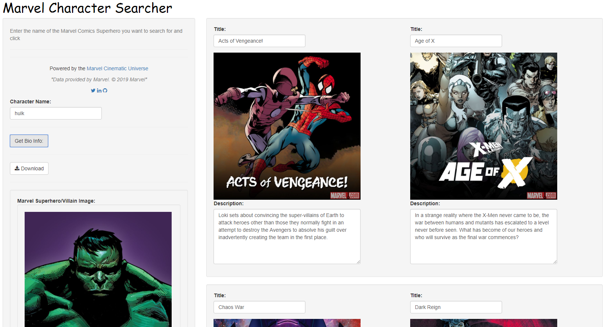
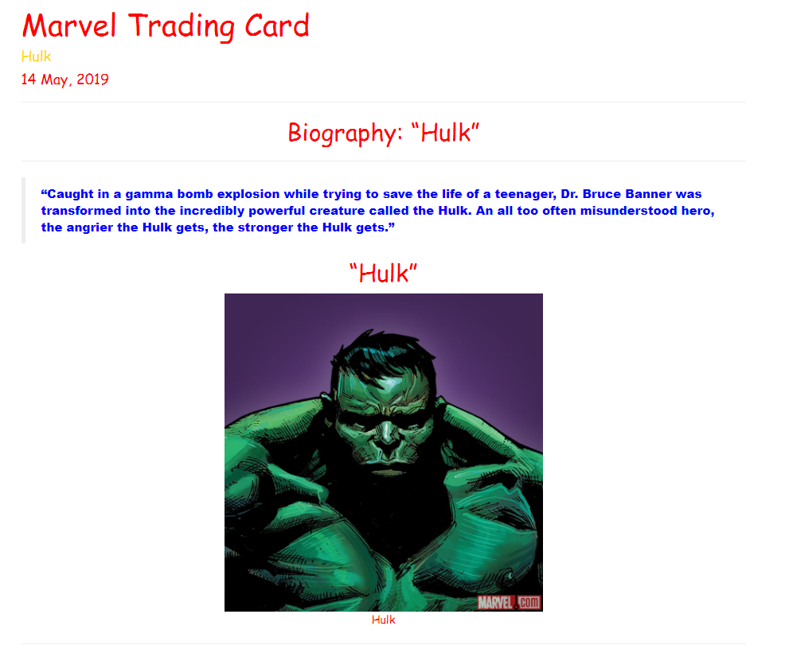
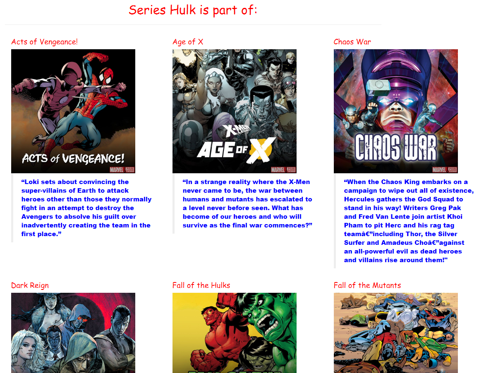

# MarvelApp
Pulls data regarding Earth's mightiest superheros Avengers Assemble!!!!

Data provided by Marvel. &copy; 2019 Marvel

[Marvel Developer Portal](https://developer.marvel.com/)

## This application allows a user to interface with the Marvel Comic Book API 

The user simply enters in the name of a superhero or villain in the Marvel Universe and the application returns the character name, biography, and the series the character is a part of. The app also utilizes the .jpg pics that Marvel uses for each character in the API. The user can then download a report of the character in .html format. 

### Marvel Character Searcher Application

### Rmarkdown Report One:

### Rmarkdown Report Two:

